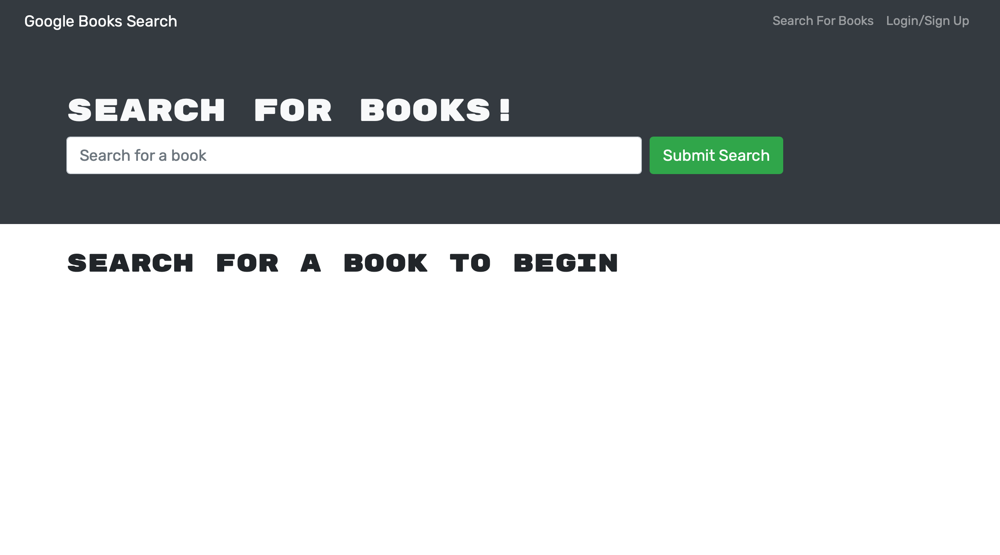

# BookSearchEngine
## Description
The main motivation for creating this project was to take an existing Book Search Engine App that runs on a RESTful API and refactor it to use a GraphQL API. The app already utilized the MERN Stack which included a React Frontend, MongoDB Database and Node.js/Express.js server. A majority of the refactoring involved creating various backendfiles such as the GraphQL queries and mutations and also changing the frontend so that it can function with the newly converted backend. Once the initial search engine was refactored it was deployed using heroku and Atlas DB.

The main problems this app solves include:
* Refactoring a RESTful api to use a GraphQL API
* Make various queries and mutations to the GraphQL API that allow the used to create a profile, login, add books to a collection and remove books from a collection. 

Overall this project helped me to become better exposed to how to execture various queries and mutations using GraphQL. It also gave me more familiarity with deployment of an app using heroku and Atlas DB.

## Installation
Node was required to be installed. Various Node_modules and packages were needed to be installed for express as well as package-lock.json which correspond with the supplied package.json. This project specifically emphasized GraphQL and Apollo
``npm i``

## Technlogies used
* Javascript
* Express.js
* Node.js
* MongoDB
* IndexedDB
* Heroku
* GraphQL
* Apollo

## Usage
``npm start``

## License 
MIT License

            Copyright (c) 2021 Hamza Khalid
            
            Permission is hereby granted, free of charge, to any person obtaining a copy of this software and associated documentation files (the "Software"), to deal in the Software without restriction, including without limitation the rights to use, copy, modify, merge, publish, distribute, sublicense, and/or sell copies of the Software, and to permit persons to whom the Software is furnished to do so, subject to the following conditions:
            
            The above copyright notice and this permission notice shall be included in all copies or substantial portions of the Software.
            
            THE SOFTWARE IS PROVIDED "AS IS", WITHOUT WARRANTY OF ANY KIND, EXPRESS OR IMPLIED, INCLUDING BUT NOT LIMITED TO THE WARRANTIES OF MERCHANTABILITY, FITNESS FOR A PARTICULAR PURPOSE AND NONINFRINGEMENT. IN NO EVENT SHALL THE AUTHORS OR COPYRIGHT HOLDERS BE LIABLE FOR ANY CLAIM, DAMAGES OR OTHER LIABILITY, WHETHER IN AN ACTION OF CONTRACT, TORT OR OTHERWISE, ARISING FROM, OUT OF OR IN CONNECTION WITH THE SOFTWARE OR THE USE OR OTHER DEALINGS IN THE SOFTWARE
            
## Badges

## Live Deployement 
 https://mighty-wildwood-43453.herokuapp.com

### Screenshot

